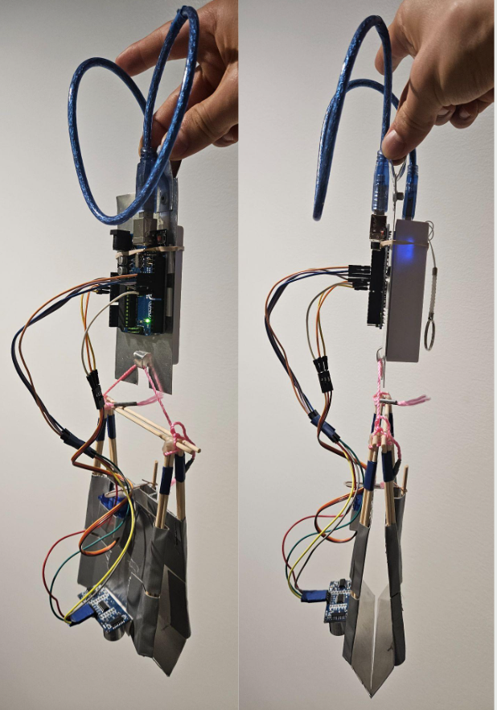
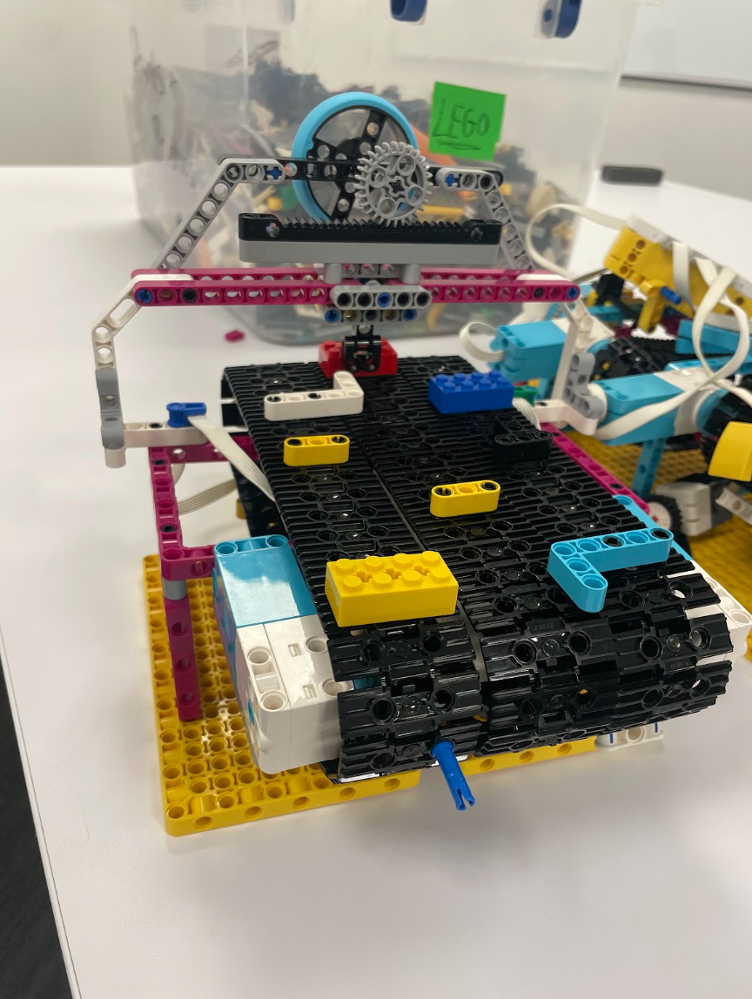
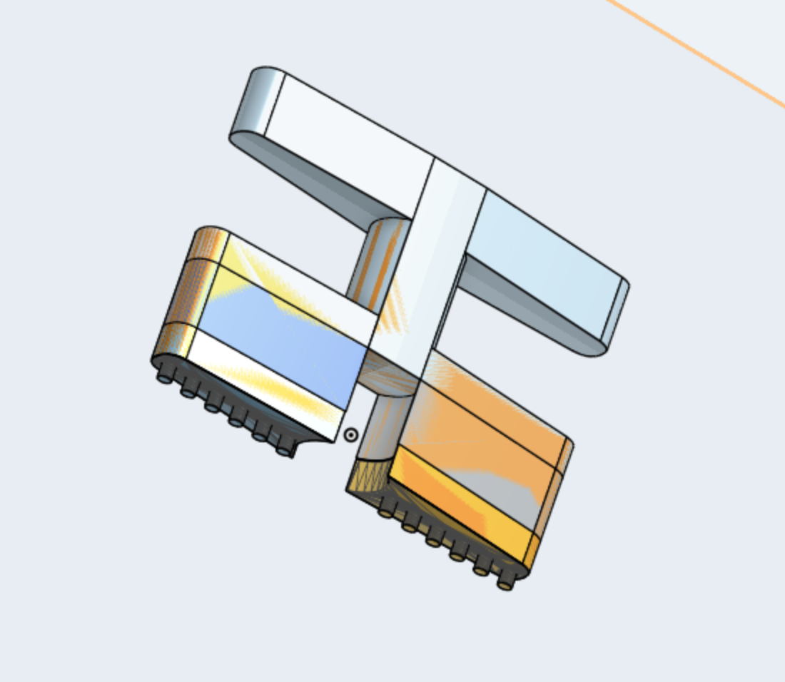
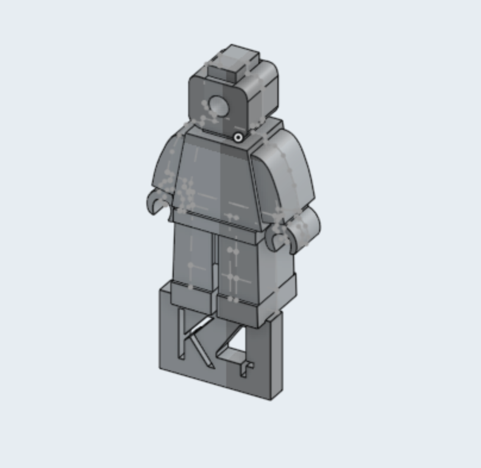
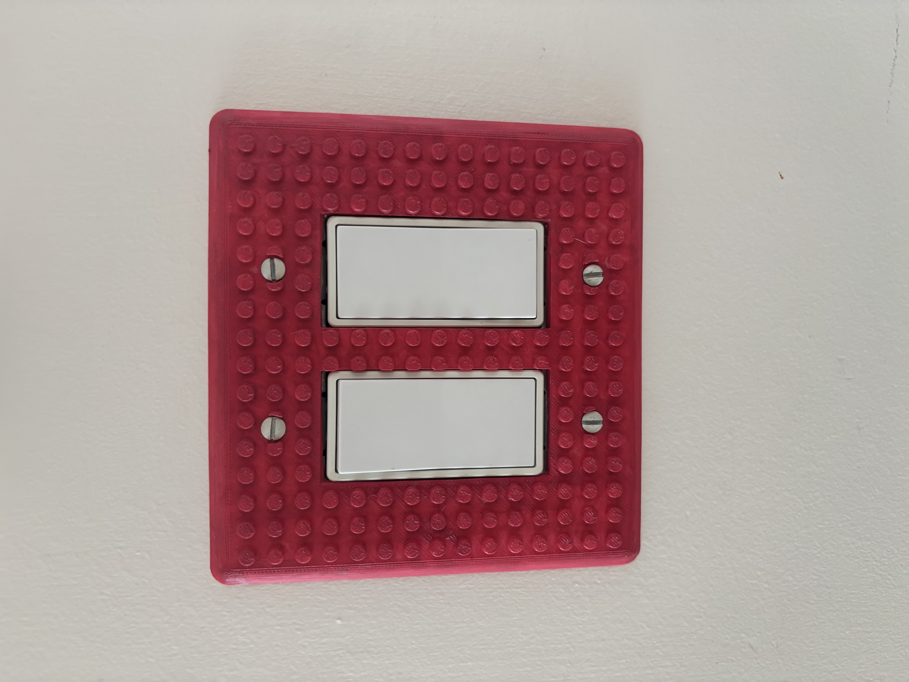
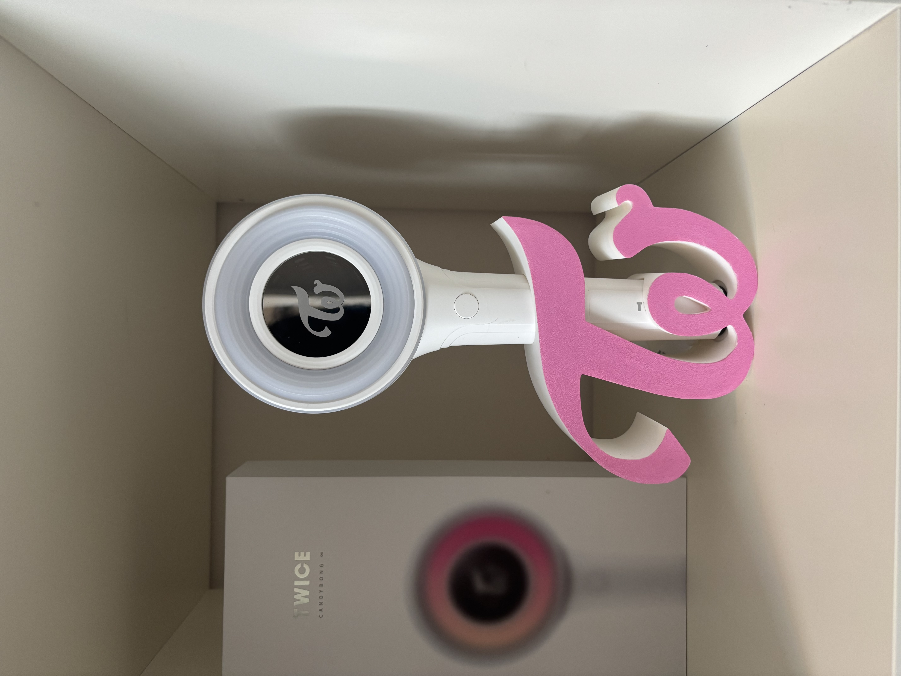
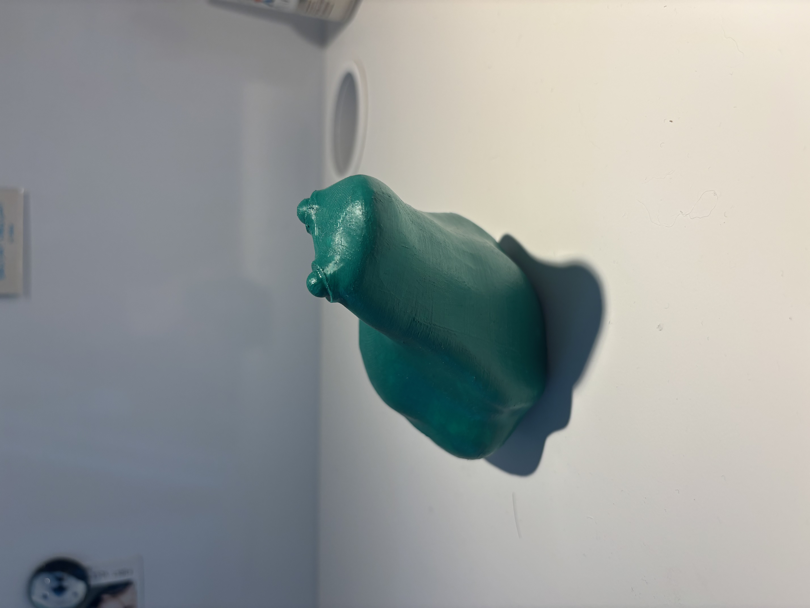
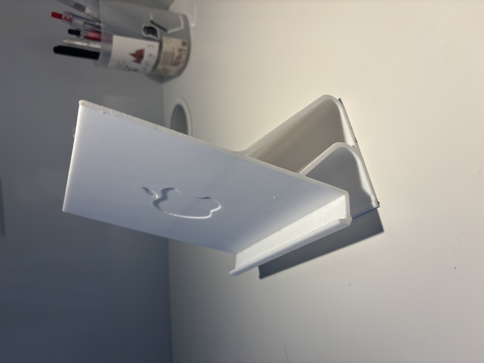
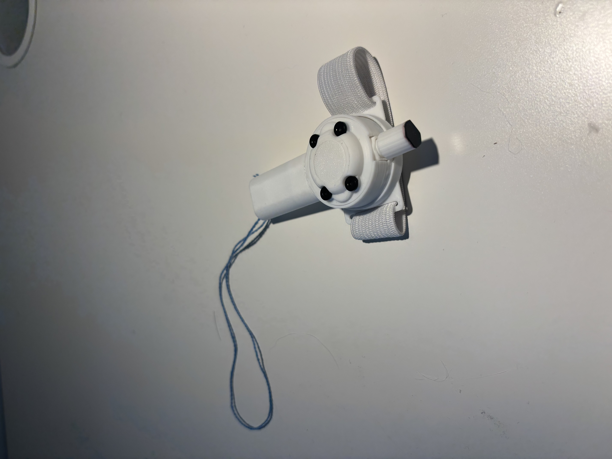
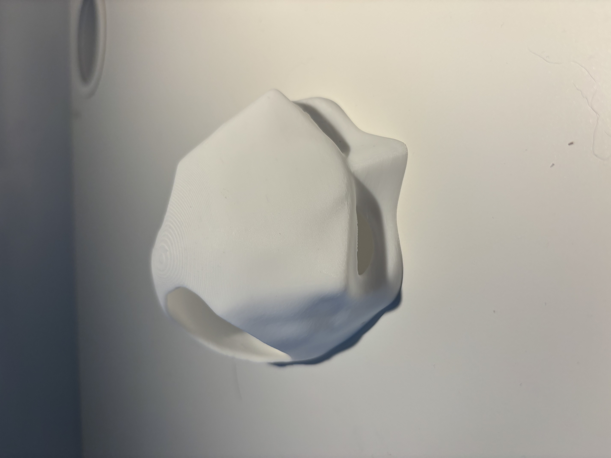

Welcome to my personal website :)

---

## About Me
Hi there! I'm Yolanda, a second year Engineering Physics student who enjoys building things!

- I am currently attending the University of British Columbia for Engineering Physics
- I like working with SolidWorks and OnShape
- I know how to use Java, C, and Python

---

## Projects!
### Autonomous Claw

  
   
  <em>Performed well in design competition, placing first in one of the individual rounds</em>

 

### Arcade Robot

  
   
  <em>Super cool robot I taught my students to make</em>

 

### Various CAD Models

   &nbsp;
  
   
  <em>Recent adventures</em>

 

### Various 3D Prints

   &nbsp;
   &nbsp;
  
   
   &nbsp;
   &nbsp;
  
   
  <em>Miscellaneous things I printed for my room</em>

## Reach me here!

  
  
  
  

---

_© 2025 Yolanda Li — Powered by [GitHub Pages](https://pages.github.com)_
